<div align="center" width="100%">
  <h1>🛠️ Desarrollo ─ Desarrollador de Juegos con IA</h1>

[](https://modelcontextprotocol.io/introduction)
[](https://openupm.com/packages/com.ivanmurzak.unity.mcp/)
[](https://hub.docker.com/r/ivanmurzakdev/unity-mcp-server)
[](https://unity.com/releases/editor/archive)
[](https://unity.com/releases/editor/archive)
[](https://github.com/IvanMurzak/Unity-MCP/actions/workflows/release.yml)</br>
[](https://discord.gg/cfbdMZX99G)
[](https://openupm.com/packages/com.ivanmurzak.unity.mcp/)
[](https://github.com/IvanMurzak/Unity-MCP/stargazers)
[](https://github.com/IvanMurzak/Unity-MCP/blob/main/LICENSE)
[](https://stand-with-ukraine.pp.ua)

  <b>[English](https://github.com/IvanMurzak/Unity-MCP/blob/main/docs/dev/Development.md) | [日本語](https://github.com/IvanMurzak/Unity-MCP/blob/main/docs/dev/Development.ja.md) | [中文](https://github.com/IvanMurzak/Unity-MCP/blob/main/docs/dev/Development.zh-CN.md)</b>

</div>

Este documento explica la estructura interna, el diseño, el estilo de código y los principios fundamentales de Unity-MCP. Úsalo si eres colaborador o deseas comprender el proyecto en profundidad.

> **[💬 Únete a nuestro servidor de Discord](https://discord.gg/cfbdMZX99G)** - ¡Haz preguntas, muestra tu trabajo y conéctate con otros desarrolladores!

## Contenido

- [Visión y Objetivos](#visión-y-objetivos)
- [Requisitos previos](#requisitos-previos)
- [Configuración del entorno local](#configuración-del-entorno-local)
- [Contribuir](#contribuir)
- [Estructura del proyecto](#estructura-del-proyecto)
  - [🔹Unity-MCP-Server](#unity-mcp-server)
    - [Imagen Docker](#imagen-docker)
  - [🔸Unity-MCP-Plugin](#unity-mcp-plugin)
    - [Paquete UPM](#paquete-upm)
    - [Editor](#editor)
    - [Runtime](#runtime)
    - [Características MCP](#características-mcp)
      - [Añadir `MCP Tool`](#añadir-mcp-tool)
      - [Añadir `MCP Prompt`](#añadir-mcp-prompt)
  - [◾Installer (Unity)](#installer-unity)
- [Estilo de código](#estilo-de-código)
  - [Convenciones clave](#convenciones-clave)
- [Ejecutar pruebas](#ejecutar-pruebas)
  - [Ejecución local](#ejecución-local)
  - [Modos de prueba](#modos-de-prueba)
  - [Interpretación de resultados de CI](#interpretación-de-resultados-de-ci)
- [CI/CD](#cicd)
  - [Para colaboradores](#para-colaboradores)
  - [Resumen de workflows](#resumen-de-workflows)
    - [🚀 release.yml](#-releaseyml)
    - [🧪 test\_pull\_request.yml](#-test_pull_requestyml)
    - [🔧 test\_unity\_plugin.yml](#-test_unity_pluginyml)
    - [📦 deploy.yml](#-deployyml)
    - [🎯 deploy\_server\_executables.yml](#-deploy_server_executablesyml)
  - [Stack tecnológico](#stack-tecnológico)
  - [Consideraciones de seguridad](#consideraciones-de-seguridad)
  - [Destinos de despliegue](#destinos-de-despliegue)

---


# Visión y Objetivos

Creemos que la IA será (si no lo es ya) una parte importante del desarrollo de videojuegos. Existen interfaces de IA extraordinarias como `Claude`, `Copilot`, `Cursor` y muchas otras que siguen mejorando. Conectamos el desarrollo de juegos *con* estas herramientas, no en su contra — Unity MCP es una base para los sistemas de IA en el ecosistema de Unity Engine, no una ventana de chat aislada.

**Objetivos del proyecto**

- Ofrecer una solución de desarrollo de juegos con IA de alta calidad **de forma gratuita** para todos
- Proporcionar una plataforma altamente personalizable para que los desarrolladores extiendan las funciones de IA según sus necesidades
- Permitir el uso de los mejores instrumentos de IA para el desarrollo de juegos, todo en un solo lugar
- Mantener y apoyar las tecnologías de IA más avanzadas, especialmente en Unity Engine y más allá

---


# Requisitos previos

Antes de contribuir, asegúrate de tener instaladas las siguientes herramientas:

| Herramienta | Versión | Propósito |
| ---- | ------- | ------- |
| [Unity Editor](https://unity.com/releases/editor/archive) | 2022.3+ / 2023.2+ / 6000.3+ | Ejecutar y probar el plugin |
| [.NET SDK](https://dotnet.microsoft.com/download) | 9.0+ | Compilar y ejecutar el servidor MCP |
| [Node.js](https://nodejs.org/) | 18+ | Ejecutar MCP Inspector para depuración |
| PowerShell | 7+ | Ejecutar scripts de compilación y utilidades |
| Docker *(opcional)* | Latest | Compilar y probar imágenes Docker |

> Una licencia personal gratuita de Unity es suficiente para contribuir.

---


# Configuración del entorno local

1. **Clonar el repositorio**
   ```bash
   git clone https://github.com/IvanMurzak/Unity-MCP.git
   cd Unity-MCP
   ```

2. **Abrir el Plugin en Unity**
   - Abre Unity Hub → Añadir proyecto → selecciona la carpeta `Unity-MCP-Plugin/`
   - Unity compilará todos los ensamblados automáticamente al abrirlo por primera vez

3. **Abrir el Servidor en tu IDE**
   - Abre `Unity-MCP-Server/Server.sln` en Visual Studio, Rider o VS Code
   - Restaura los paquetes NuGet: `dotnet restore`

4. **Ejecutar el Servidor localmente**
   ```bash
   cd Unity-MCP-Server
   dotnet run --project com.IvanMurzak.Unity.MCP.Server.csproj -- --port 8080 --client-transport stdio
   ```

5. **Apuntar el Plugin a tu servidor local** *(opcional — omite el binario descargado automáticamente)*
   - En Unity: abre `Window/AI Game Developer (Unity-MCP)`
   - Establece el puerto para que coincida con tu servidor local (`8080` por defecto)
   - El plugin se conectará automáticamente

6. **Depurar con MCP Inspector** *(opcional)*
   ```bash
   Commands/start_mcp_inspector.bat   # Windows
   ```
   Requiere Node.js. Abre una interfaz en el navegador en `http://localhost:5173` para la inspección en tiempo real de los mensajes del protocolo MCP.

---


# Contribuir

Construyamos juntos el brillante futuro del desarrollo de videojuegos; contribuye al proyecto. Usa este documento para entender la estructura del proyecto y cómo funciona exactamente.

1. [Haz un fork del proyecto](https://github.com/IvanMurzak/Unity-MCP/fork)
2. Realiza tus mejoras siguiendo el estilo de código
3. [Crea un Pull Request](https://github.com/IvanMurzak/Unity-MCP/compare)


# Estructura del proyecto

```mermaid
graph LR
  A(◽Agente IA)
  B(🔹Unity-MCP-Server)
  C(🔸Unity-MCP-Plugin)
  D(🎮Unity)

  %% Relaciones
  A <--> B
  B <--> C
  C <--> D
```



◽**Agente IA** - Cualquier interfaz de IA como: *Claude*, *Copilot*, *Cursor* u otras. No forma parte de este proyecto, pero es un elemento importante de la arquitectura.

🔹**Unity-MCP-Server** - `Servidor MCP` que se conecta al `Agente IA` y opera con él. Al mismo tiempo, `Unity-MCP-Server` se comunica con `Unity-MCP-Plugin` a través de SignalR. Puede ejecutarse localmente o en la nube con transporte HTTP. Stack tecnológico: `C#`, `ASP.NET Core`, `SignalR`

🔸**Unity-MCP-Plugin** - `Plugin de Unity` integrado en un proyecto Unity con acceso a la API de Unity. Se comunica con `Unity-MCP-Server` y ejecuta comandos provenientes del servidor. Stack tecnológico: `C#`, `Unity`, `SignalR`

🎮**Unity** - Unity Engine, motor de videojuegos.

---

## 🔹Unity-MCP-Server

Una aplicación C# ASP.NET Core que actúa como puente entre los agentes de IA (interfaces de IA como Claude o Cursor) e instancias de Unity Editor. El servidor implementa el [Model Context Protocol](https://github.com/modelcontextprotocol) utilizando el [csharp-sdk](https://github.com/modelcontextprotocol/csharp-sdk).

> Ubicación del proyecto: `Unity-MCP-Server`

**Responsabilidades principales:**

1. **Implementación del protocolo MCP** ([ExtensionsMcpServer.cs](Unity-MCP-Server/src/Extension/ExtensionsMcpServer.cs))
   - Implementa el servidor MCP con soporte para Tools, Prompts y Resources
   - Soporta métodos de transporte STDIO y HTTP
   - Gestiona solicitudes de agentes de IA: `CallTool`, `GetPrompt`, `ReadResource` y sus operaciones de listado
   - Envía notificaciones a los agentes de IA cuando cambian las capacidades (actualizaciones de listas de tools/prompts)

2. **Comunicación a través del Hub SignalR** ([RemoteApp.cs](Unity-MCP-Server/src/Hub/RemoteApp.cs), [BaseHub.cs](Unity-MCP-Server/src/Hub/BaseHub.cs))
   - Gestiona la comunicación bidireccional en tiempo real con Unity-MCP-Plugin mediante SignalR
   - Maneja el handshake de versión para garantizar la compatibilidad de API entre el servidor y el plugin
   - Rastrea las conexiones de clientes y gestiona las desconexiones
   - Enruta las notificaciones de actualización de tools/prompts/resources desde Unity a los agentes de IA

3. **Enrutamiento y ejecución de solicitudes** ([ToolRouter.Call.cs](Unity-MCP-Server/src/Routing/Tool/ToolRouter.Call.cs), [PromptRouter.Get.cs](Unity-MCP-Server/src/Routing/Prompt/PromptRouter.Get.cs), [ResourceRouter.ReadResource.cs](Unity-MCP-Server/src/Routing/Resource/ResourceRouter.ReadResource.cs))
   - Enruta las solicitudes de los agentes de IA a la instancia adecuada de Unity-MCP-Plugin
   - Gestiona llamadas a Tools, solicitudes de Prompts y lecturas de Resources
   - Realiza el manejo de errores y validación
   - Convierte entre los formatos del protocolo MCP y los modelos de datos internos

4. **Servicio de ejecución remota** ([RemoteToolRunner.cs](Unity-MCP-Server/src/Client/RemoteToolRunner.cs), [RemotePromptRunner.cs](Unity-MCP-Server/src/Client/RemotePromptRunner.cs), [RemoteResourceRunner.cs](Unity-MCP-Server/src/Client/RemoteResourceRunner.cs))
   - Invoca procedimientos remotos en Unity-MCP-Plugin a través de SignalR
   - Rastrea solicitudes asíncronas y gestiona tiempos de espera
   - Implementa patrones de solicitud/respuesta con soporte de cancelación
   - Maneja callbacks de finalización de solicitudes desde instancias de Unity

5. **Gestión del ciclo de vida del servidor** ([Program.cs](Unity-MCP-Server/src/Program.cs), [McpServerService.cs](Unity-MCP-Server/src/McpServerService.cs))
   - Configura e inicia el servidor web ASP.NET Core con Kestrel
   - Inicializa el servidor MCP, el hub SignalR y la inyección de dependencias
   - Gestiona el registro con NLog (redirige los logs a stderr en modo STDIO)
   - Maneja el apagado ordenado y la limpieza de recursos
   - Se suscribe a eventos de cambio de lista de tools/prompts de Unity

### Imagen Docker

`Unity-MCP-Server` puede desplegarse en una imagen Docker. El proyecto contiene los archivos `Dockerfile` y `.dockerignore` en su carpeta raíz.

---

## 🔸Unity-MCP-Plugin

Se integra en el entorno de Unity. Utiliza `Unity-MCP-Common` para buscar *Tools*, *Resources* y *Prompts* MCP en el código base local mediante reflexión. Se comunica con `Unity-MCP-Server` para enviar actualizaciones sobre *Tools*, *Resources* y *Prompts* MCP. Recibe comandos del `Unity-MCP-Server` y los ejecuta.

> Ubicación del proyecto: `Unity-MCP-Plugin`

### Paquete UPM

`Unity-MCP-Plugin` es un paquete UPM. La carpeta raíz del paquete se encuentra en `Unity-MCP-Plugin/Assets/root` y contiene el archivo `package.json`, que se utiliza para publicar el paquete directamente desde una release de GitHub en [OpenUPM](https://openupm.com/).

> Ubicación: `Unity-MCP-Plugin/Assets/root`

### Editor

El componente Editor proporciona integración con Unity Editor, implementando capacidades MCP (Tools, Prompts, Resources) y gestionando el ciclo de vida de `Unity-MCP-Server`.

> Ubicación: `Unity-MCP-Plugin/Assets/root/Editor`

**Responsabilidades principales:**

1. **Gestión del ciclo de vida del Plugin** ([Startup.cs](../../Unity-MCP-Plugin/Assets/root/Editor/Scripts/Startup.cs))
   - Se auto-inicializa al cargar Unity Editor mediante `[InitializeOnLoad]`
   - Gestiona la persistencia de la conexión a lo largo del ciclo de vida del Editor (recarga de ensamblados, transiciones de modo Play)
   - Reconexión automática tras la recarga del dominio o la salida del modo Play

2. **Gestión del binario del servidor MCP** ([McpServerManager.cs](../../Unity-MCP-Plugin/Assets/root/Editor/Scripts/McpServerManager.cs))
   - Descarga y gestiona el ejecutable de `Unity-MCP-Server` desde las releases de GitHub
   - Selección de binario multiplataforma (Windows/macOS/Linux, x86/x64/ARM/ARM64)
   - Aplicación de compatibilidad de versiones entre el servidor y el plugin
   - Generación de configuración para agentes de IA (JSON con rutas de ejecutables y ajustes de conexión)

3. **Implementación de la API MCP** ([Scripts/API/](../../Unity-MCP-Plugin/Assets/root/Editor/Scripts/API/))
   - **Tools** (50+): GameObject, Scene, Assets, Prefabs, Scripts, Components, Editor Control, Test Runner, Console, Reflection
   - **Prompts**: Plantillas predefinidas para tareas comunes de desarrollo en Unity
   - **Resources**: Acceso basado en URI a datos del Unity Editor con serialización JSON
   - Todas las operaciones se ejecutan en el hilo principal de Unity para garantizar la seguridad de hilos
   - Descubrimiento basado en atributos mediante `[McpPluginTool]`, `[McpPluginPrompt]`, `[McpPluginResource]`

4. **Interfaz del Editor** ([Scripts/UI/](../../Unity-MCP-Plugin/Assets/root/Editor/Scripts/UI/))
   - Ventana de configuración para la gestión de conexiones (`Window > AI Game Developer`)
   - Gestión del binario del servidor y acceso a logs mediante elementos del menú de Unity

### Runtime

El componente Runtime proporciona la infraestructura principal compartida entre los modos Editor y Runtime, gestionando la comunicación SignalR, la serialización y el acceso seguro a la API de Unity desde múltiples hilos.

> Ubicación: `Unity-MCP-Plugin/Assets/root/Runtime`

**Responsabilidades principales:**

1. **Núcleo del Plugin y conexión SignalR** ([UnityMcpPlugin.cs](../../Unity-MCP-Plugin/Assets/root/Runtime/UnityMcpPlugin.cs))
   - Singleton thread-safe que gestiona el ciclo de vida del plugin mediante `BuildAndStart()`
   - Descubre MCP Tools/Prompts/Resources de los ensamblados usando reflexión
   - Establece la conexión SignalR con Unity-MCP-Server con monitoreo de estado reactivo (biblioteca R3)
   - Gestión de configuración: host, puerto, tiempo de espera, compatibilidad de versiones

2. **Dispatcher del hilo principal** ([MainThreadDispatcher.cs](../../Unity-MCP-Plugin/Assets/root/Runtime/Utils/MainThreadDispatcher.cs))
   - Redirige las llamadas a la API de Unity desde hilos en segundo plano de SignalR al hilo principal de Unity
   - Ejecución basada en cola en el bucle Update de Unity
   - Fundamental para la ejecución segura de operaciones MCP

3. **Serialización de tipos Unity** ([ReflectionConverters/](../../Unity-MCP-Plugin/Assets/root/Runtime/ReflectionConverters/), [JsonConverters/](../../Unity-MCP-Plugin/Assets/root/Runtime/JsonConverters/))
   - Serialización JSON personalizada para tipos de Unity (GameObject, Component, Transform, Vector3, Quaternion, etc.)
   - Convierte objetos de Unity a formato de referencia (`GameObjectRef`, `ComponentRef`) con seguimiento de instanceID
   - Se integra con ReflectorNet para la introspección de objetos y la serialización de componentes
   - Proporciona esquemas JSON para las definiciones de tipos del protocolo MCP

4. **Registro y diagnósticos** ([Logger/](../../Unity-MCP-Plugin/Assets/root/Runtime/Logger/), [Unity/Logs/](../../Unity-MCP-Plugin/Assets/root/Runtime/Unity/Logs/))
   - Conecta Microsoft.Extensions.Logging con la consola de Unity con niveles codificados por color
   - Recopila logs de la consola de Unity para su recuperación por parte de la IA a través de MCP Tools

### Características MCP

#### Añadir `MCP Tool`

```csharp
[McpPluginToolType]
public class Tool_GameObject
{
    [McpPluginTool
    (
        "MyCustomTask",
        Title = "Create a new GameObject"
    )]
    [Description("Explica aquí al LLM qué es esto y cuándo debe llamarse.")]
    public string CustomTask
    (
        [Description("Explica al LLM qué es esto.")]
        string inputData
    )
    {
        // hacer cualquier cosa en un hilo en segundo plano

        return MainThread.Instance.Run(() =>
        {
            // hacer algo en el hilo principal si es necesario

            return $"[Success] Operation completed.";
        });
    }
}
```

#### Añadir `MCP Prompt`

`MCP Prompt` te permite inyectar prompts personalizados en la conversación con el LLM. Soporta dos roles de emisor: User y Assistant. Es una forma rápida de instruir al LLM para que realice tareas específicas. Puedes generar prompts usando datos personalizados, proporcionando listas o cualquier otra información relevante.

```csharp
[McpPluginPromptType]
public static class Prompt_ScriptingCode
{
    [McpPluginPrompt(Name = "add-event-system", Role = Role.User)]
    [Description("Implement UnityEvent-based communication system between GameObjects.")]
    public string AddEventSystem()
    {
        return "Create event system using UnityEvents, UnityActions, or custom event delegates for decoupled communication between game systems and components.";
    }
}
```

---

## ◾Installer (Unity)

```mermaid
graph LR
  A(◾Installer)
  subgraph Instalación
    B(🎮Unity)
    C(🔸Unity-MCP-Plugin)
  end

  %% Relaciones
  A --> B
  B -.- C
```

**Installer** instala `Unity-MCP-Plugin` y sus dependencias como paquetes NPM en un proyecto Unity.

> Ubicación del proyecto: `Installer`

---


# Estilo de código

Este proyecto sigue patrones de codificación C# consistentes. Todo el código nuevo debe adherirse a estas convenciones.

## Convenciones clave

1. **Encabezados de archivo**: Incluir aviso de copyright en formato de comentario de caja al inicio de cada archivo
2. **Contexto nullable**: Usar `#nullable enable` para seguridad de nulos — sin nulos implícitos
3. **Atributos**: Usar `[McpPluginTool]`, `[McpPluginPrompt]`, `[McpPluginResource]` para el descubrimiento MCP
4. **Clases parciales**: Dividir la funcionalidad en varios archivos (por ej., `Tool_GameObject.Create.cs`, `Tool_GameObject.Destroy.cs`)
5. **Ejecución en el hilo principal**: Envolver todas las llamadas a la API de Unity con `MainThread.Instance.Run()`
6. **Manejo de errores**: Centralizar los mensajes de error en clases `Error` anidadas dentro de la clase del tool
7. **Formato de retorno**: Usar los prefijos `[Success]` o `[Error]` en todas las cadenas de retorno para retroalimentación estructurada a la IA
8. **Descripciones**: Anotar todas las APIs públicas y parámetros con `[Description]` para orientación de la IA
9. **Nomenclatura**: PascalCase para miembros y tipos públicos, `_camelCase` para campos privados de solo lectura
10. **Seguridad de nulos**: Usar tipos nullable (`?`) y operadores de coalescencia nula (`??`, `??=`)

El ejemplo anotado a continuación demuestra cómo funcionan estas convenciones en conjunto:

```csharp
/*
┌──────────────────────────────────────────────────────────────────┐
│  Author: Ivan Murzak (https://github.com/IvanMurzak)             │
│  Repository: GitHub (https://github.com/IvanMurzak/Unity-MCP)    │
│  Copyright (c) 2025 Ivan Murzak                                  │
│  Licensed under the Apache License, Version 2.0.                 │
│  See the LICENSE file in the project root for more information.  │
└──────────────────────────────────────────────────────────────────┘
*/

// Habilitar tipos de referencia nullable para mayor seguridad con nulos
#nullable enable

// Compilación condicional para código específico de plataforma
#if UNITY_EDITOR
using UnityEditor;
#endif

using System;
using System.ComponentModel;
using System.Threading.Tasks;
using com.IvanMurzak.Unity.MCP.Common;
using com.IvanMurzak.Unity.MCP.Utils;
using UnityEngine;

namespace com.IvanMurzak.Unity.MCP.Editor.API
{
    // Usar [McpPluginToolType] para clases de tools - habilita el descubrimiento MCP via reflexión
    [McpPluginToolType]
    // Las clases parciales permiten dividir la implementación en múltiples archivos
    // Patrón: Un archivo por operación (por ej., GameObject.Create.cs, GameObject.Destroy.cs)
    public partial class Tool_GameObject
    {
        // La clase Error anidada centraliza los mensajes de error para mayor mantenibilidad
        public static class Error
        {
            // Métodos estáticos para formato de error consistente
            public static string GameObjectNameIsEmpty()
                => "GameObject name is empty. Please provide a valid name.";

            public static string NotFoundGameObjectAtPath(string path)
                => $"GameObject '{path}' not found.";
        }

        // Declaración de MCP Tool con metadatos basados en atributos
        [McpPluginTool(
            "GameObject_Create",                    // Identificador único del tool
            Title = "Create a new GameObject"       // Título legible por humanos
        )]
        // El atributo Description orienta a la IA sobre cuándo y cómo usar este tool
        [Description(@"Create a new GameObject in the scene.
Provide position, rotation, and scale to minimize subsequent operations.")]
        public string Create
        (
            // Las descripciones de parámetros ayudan a la IA a entender las entradas esperadas
            [Description("Name of the new GameObject.")]
            string name,

            [Description("Parent GameObject reference. If not provided, created at scene root.")]
            GameObjectRef? parentGameObjectRef = null,  // Nullable con valor por defecto

            [Description("Transform position of the GameObject.")]
            Vector3? position = null,                    // Struct de Unity, nullable

            [Description("Transform rotation in Euler angles (degrees).")]
            Vector3? rotation = null,

            [Description("Transform scale of the GameObject.")]
            Vector3? scale = null
        )
        {
            // cualquier lógica en hilo en segundo plano
            // ...

            return MainThread.Instance.Run(() =>           // Todas las llamadas a la API de Unity DEBEN ejecutarse en el hilo principal
            {
                // Validar parámetros de entrada al inicio
                if (string.IsNullOrEmpty(name))
                    return Error.GameObjectNameIsEmpty();

                // Asignación de coalescencia nula para valores por defecto
                position ??= Vector3.zero;
                rotation ??= Vector3.zero;
                scale ??= Vector3.one;

                // Crear GameObject usando la API de Unity
                var go = new GameObject(name);

                // Establecer padre si se proporcionó
                if (parentGameObjectRef?.IsValid ?? false)
                {
                    var parentGo = parentGameObjectRef.FindGameObject(out var error);
                    if (error != null)
                        return $"{error}";

                    go.transform.SetParent(parentGo.transform, worldPositionStays: false);
                }

                // Aplicar valores de transformación
                go.transform.localPosition = position.Value;
                go.transform.localRotation = Quaternion.Euler(rotation.Value);
                go.transform.localScale = scale.Value;

                // Marcar como modificado para el Unity Editor
                EditorUtility.SetDirty(go);

                // Devolver mensaje de éxito con datos estructurados
                // Usar interpolación de cadenas para un formato legible
                return $"[Success] Created GameObject.\ninstanceID: {go.GetInstanceID()}, path: {go.GetPath()}";
            });
        }

        // Ejemplo de método asíncrono con manejo de errores apropiado
        public static async Task<string> AsyncOperation(string parameter)
        {
            try
            {
                // Trabajo en segundo plano puede ocurrir aquí
                await Task.Delay(100);

                // Cambiar al hilo principal para las llamadas a la API de Unity
                return await MainThread.Instance.RunAsync(() =>
                {
                    // Llamadas a la API de Unity aquí
                    return "[Success] Async operation completed.";
                });
            }
            catch (Exception ex)
            {
                // Registrar excepciones con logging estructurado
                Debug.LogException(ex);
                return $"[Error] Operation failed: {ex.Message}";
            }
        }
    }

    // Archivo de clase parcial separado para prompts
    [McpPluginPromptType]
    public static partial class Prompt_SceneManagement
    {
        // MCP Prompt con definición de rol (User o Assistant)
        [McpPluginPrompt(Name = "setup-basic-scene", Role = Role.User)]
        [Description("Setup a basic scene with camera, lighting, and environment.")]
        public static string SetupBasicScene()
        {
            // Devolver texto del prompt para que lo procese la IA
            return "Create a basic Unity scene with Main Camera, Directional Light, and basic environment setup.";
        }
    }
}
```

---


# Ejecutar pruebas

Las pruebas cubren tres modos en tres versiones de Unity (2022, 2023, 6000) y dos sistemas operativos (Windows, Ubuntu) — 18 combinaciones en total.

## Ejecución local

**Unity Test Runner (GUI)**
1. Abre el proyecto `Unity-MCP-Plugin/` en Unity
2. Ve a `Window > General > Test Runner`
3. Selecciona la pestaña **EditMode** o **PlayMode**
4. Haz clic en **Run All** o selecciona pruebas específicas y usa **Run Selected**

**Script de PowerShell (línea de comandos)**
```powershell
# Ejecutar pruebas para una versión de Unity y modo específicos
.\commands\run-unity-tests.ps1 -unityVersion "6000.3.1f1" -testMode "editmode"
```

## Modos de prueba

| Modo | Qué prueba | Ubicación |
| ---- | ------------- | -------- |
| **EditMode** | Lógica de tools, serialización, utilidades del editor — sin necesidad de modo Play | `Assets/root/Tests/Editor` |
| **PlayMode** | Plugin en runtime, conexión SignalR, dispatch al hilo principal | `Assets/root/Tests/Runtime` |
| **Standalone** | Build de player completo con plugin embebido | Requiere un paso de build de player |

## Interpretación de resultados de CI

Cada trabajo de CI se llama `test-unity-{version}-{mode}` (por ej., `test-unity-6000-3-1f1-editmode`). Cuando falla un trabajo:
1. Abre el trabajo fallido en GitHub Actions
2. Expande el paso **Unity Test Runner** para ver la salida en línea
3. Descarga el artefacto **test-results** para el informe XML completo
4. Corrige la prueba y haz push — CI se vuelve a ejecutar automáticamente

---


# CI/CD

El proyecto implementa un pipeline de CI/CD completo usando GitHub Actions con múltiples workflows que orquestan los procesos de compilación, prueba y despliegue.

## Para colaboradores

Esto es lo que necesitas saber al trabajar con CI como colaborador:

- **Los PRs de forks** requieren que un mantenedor aplique la etiqueta `ci-ok` antes de que comience la CI. Es una medida de seguridad para evitar que código no confiable acceda a los secretos.
- **No modifiques los archivos de workflow** en `.github/workflows/` en tu PR — la verificación de CI se abortará si detecta cambios en estos archivos de un colaborador no confiable.
- **Las 18 combinaciones de la matriz de pruebas deben pasar** antes de que un PR pueda fusionarse. Si tu cambio rompe solo una combinación (por ej., `2022-editmode`), ese trabajo mostrará una ✗ roja mientras los demás están en verde.
- **Re-ejecutar trabajos fallidos:** Ve al PR → pestaña **Checks** → haz clic en un trabajo fallido → **Re-run failed jobs**. Esto es útil para fallos transitorios del Unity Editor.
- **Orden de ejecución de workflows:** `test_pull_request.yml` se ejecuta en tu PR. `release.yml` solo se ejecuta después de fusionar en `main`. No necesitas activar las releases manualmente.

## Resumen de workflows

> Ubicación: `.github/workflows`

### 🚀 [release.yml](../../.github/workflows/release.yml)

**Disparador:** Push a la rama `main`
**Propósito:** Workflow principal de release que orquesta todo el proceso de publicación

**Proceso:**

1. **Verificación de versión** - Extrae la versión de [package.json](../../Unity-MCP-Plugin/Assets/root/package.json) y comprueba si ya existe el tag de release
2. **Compilación del Installer de Unity** - Prueba y exporta el instalador del paquete Unity (`AI-Game-Dev-Installer.unitypackage`)
3. **Compilación del servidor MCP** - Compila ejecutables multiplataforma (Windows, macOS, Linux) usando [build-all.sh](../../Unity-MCP-Server/build-all.sh)
4. **Pruebas del Plugin de Unity** - Ejecuta pruebas completas en:
   - 3 versiones de Unity: `2022.3.62f3`, `2023.2.22f1`, `6000.3.1f1`
   - 3 modos de prueba: `editmode`, `playmode`, `standalone`
   - 2 sistemas operativos: `windows-latest`, `ubuntu-latest`
   - Total: **18 combinaciones en la matriz de pruebas**
5. **Creación de release** - Genera notas de versión a partir de commits y crea la release de GitHub con el tag
6. **Publicación** - Sube el paquete del instalador de Unity y los ejecutables del servidor MCP a la release
7. **Notificación de Discord** - Envía las notas de la release formateadas al canal de Discord
8. **Despliegue** - Activa el workflow de despliegue para NuGet y Docker
9. **Limpieza** - Elimina los artefactos de compilación tras la publicación exitosa

### 🧪 [test_pull_request.yml](../../.github/workflows/test_pull_request.yml)

**Disparador:** Pull requests a las ramas `main` o `dev`
**Propósito:** Valida los cambios del PR antes de fusionarlos

**Proceso:**

1. Compila los ejecutables del servidor MCP para todas las plataformas
2. Ejecuta las mismas 18 combinaciones de la matriz de pruebas de Unity que el workflow de release
3. Todas las pruebas deben pasar antes de que el PR pueda fusionarse

### 🔧 [test_unity_plugin.yml](../../.github/workflows/test_unity_plugin.yml)

**Tipo:** Workflow reutilizable
**Propósito:** Workflow de pruebas de Unity parametrizado utilizado por los workflows de release y PR

**Características:**

- Acepta parámetros: `projectPath`, `unityVersion`, `testMode`
- Se ejecuta en matriz de sistemas operativos (Windows, Ubuntu)
- Usa Game CI Unity Test Runner con imágenes Docker personalizadas
- Implementa verificaciones de seguridad para colaboradores de PRs (requiere la etiqueta `ci-ok` para PRs no confiables)
- Aborta si los archivos de workflow son modificados en PRs
- Almacena en caché la Librería de Unity para ejecuciones posteriores más rápidas
- Sube artefactos de prueba para depuración

### 📦 [deploy.yml](../../.github/workflows/deploy.yml)

**Disparador:** Llamado por el workflow de release O dispatch manual O al publicar una release
**Propósito:** Despliega el servidor MCP en NuGet y Docker Hub

**Trabajos:**

**1. Despliegue en NuGet:**

- Compila y prueba el servidor MCP
- Empaqueta el paquete NuGet
- Publica en [nuget.org](https://www.nuget.org/packages/com.IvanMurzak.Unity.MCP.Server)

**2. Despliegue de imagen Docker:**

- Compila imagen Docker multiplataforma (linux/amd64, linux/arm64)
- Sube a [Docker Hub](https://hub.docker.com/r/ivanmurzakdev/unity-mcp-server)
- Etiqueta con número de versión y `latest`
- Usa caché de GitHub Actions para optimización de compilación

### 🎯 [deploy_server_executables.yml](../../.github/workflows/deploy_server_executables.yml)

**Disparador:** Release de GitHub publicada
**Propósito:** Compila y sube ejecutables multiplataforma del servidor a la release

**Proceso:**

- Se ejecuta en macOS para soporte de compilación cruzada
- Compila ejecutables para Windows, macOS, Linux usando [build-all.sh](../../Unity-MCP-Server/build-all.sh)
- Crea archivos ZIP para cada plataforma
- Sube los archivos a la release de GitHub

## Stack tecnológico

- **Plataforma de CI:** GitHub Actions
- **Pruebas de Unity:** [Game CI](https://game.ci/) con Unity Test Runner
- **Containerización:** Docker con compilaciones multiplataforma
- **Gestión de paquetes:** NuGet, OpenUPM, Docker Hub
- **Herramientas de compilación:** .NET 9.0, scripts bash
- **Almacenamiento de artefactos:** Artefactos de GitHub Actions (temporales), GitHub Releases (permanente)

## Consideraciones de seguridad

- Licencia, correo electrónico y contraseña de Unity almacenados como secretos de GitHub
- Clave API de NuGet y credenciales de Docker protegidas
- El workflow de PR incluye verificaciones de seguridad para modificaciones de archivos de workflow
- Las contribuciones de PRs no confiables requieren aprobación del mantenedor mediante la etiqueta `ci-ok`

## Destinos de despliegue

1. **GitHub Releases** - Paquete del instalador de Unity y ejecutables del servidor MCP
2. **NuGet** - Paquete del servidor MCP para desarrolladores .NET
3. **Docker Hub** - Servidor MCP en contenedor para despliegues en la nube
4. **OpenUPM** - Paquete del plugin de Unity (sincronizado automáticamente desde las releases de GitHub)


