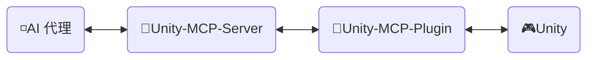
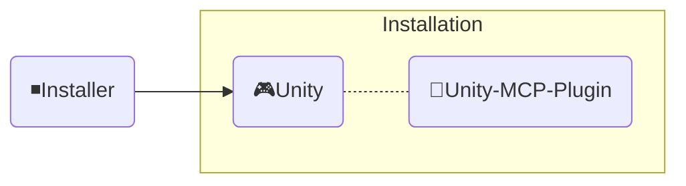

<div align="center" width="100%">
  <h1>🛠️ 开发文档 ─ AI 游戏开发者</h1>

[](https://modelcontextprotocol.io/introduction)
[](https://openupm.com/packages/com.ivanmurzak.unity.mcp/)
[](https://hub.docker.com/r/ivanmurzakdev/unity-mcp-server)
[](https://unity.com/releases/editor/archive)
[](https://unity.com/releases/editor/archive)
[](https://github.com/IvanMurzak/Unity-MCP/actions/workflows/release.yml)</br>
[](https://discord.gg/cfbdMZX99G)
[](https://openupm.com/packages/com.ivanmurzak.unity.mcp/)
[](https://github.com/IvanMurzak/Unity-MCP/stargazers)
[](https://github.com/IvanMurzak/Unity-MCP/blob/main/LICENSE)
[](https://stand-with-ukraine.pp.ua)

  <b>[English](https://github.com/IvanMurzak/Unity-MCP/blob/main/docs/dev/Development.md) | [Español](https://github.com/IvanMurzak/Unity-MCP/blob/main/docs/dev/Development.es.md) | [日本語](https://github.com/IvanMurzak/Unity-MCP/blob/main/docs/dev/Development.ja.md)</b>

</div>

本文档介绍 Unity-MCP 的内部结构、设计思路、代码风格及主要原则。如果您是贡献者或希望深入了解该项目，请参阅本文档。

> **[💬 加入我们的 Discord 服务器](https://discord.gg/cfbdMZX99G)** - 提问、展示您的作品，并与其他开发者交流！

## 目录

- [愿景与目标](#愿景与目标)
- [前置条件](#前置条件)
- [本地开发环境搭建](#本地开发环境搭建)
- [贡献](#贡献)
- [项目结构](#项目结构)
  - [🔹Unity-MCP-Server](#unity-mcp-server)
    - [Docker 镜像](#docker-镜像)
  - [🔸Unity-MCP-Plugin](#unity-mcp-plugin)
    - [UPM 包](#upm-包)
    - [编辑器](#编辑器)
    - [运行时](#运行时)
    - [MCP 功能](#mcp-功能)
      - [添加 `MCP Tool`](#添加-mcp-tool)
      - [添加 `MCP Prompt`](#添加-mcp-prompt)
  - [◾Installer（Unity）](#installerunity)
- [代码风格](#代码风格)
  - [关键约定](#关键约定)
- [运行测试](#运行测试)
  - [本地运行](#本地运行)
  - [测试模式](#测试模式)
  - [解读 CI 结果](#解读-ci-结果)
- [CI/CD](#cicd)
  - [面向贡献者](#面向贡献者)
  - [工作流概览](#工作流概览)
    - [🚀 release.yml](#-releaseyml)
    - [🧪 test\_pull\_request.yml](#-test_pull_requestyml)
    - [🔧 test\_unity\_plugin.yml](#-test_unity_pluginyml)
    - [📦 deploy.yml](#-deployyml)
    - [🎯 deploy\_server\_executables.yml](#-deploy_server_executablesyml)
  - [技术栈](#技术栈)
  - [安全注意事项](#安全注意事项)
  - [部署目标](#部署目标)

---


# 愿景与目标

我们相信，AI 已经（或即将）成为游戏开发中不可或缺的重要组成部分。`Claude`、`Copilot`、`Cursor` 等出色的 AI 界面持续进化。我们将游戏开发*与*这些工具相结合，而非对立——Unity MCP 是 Unity 引擎生态系统中 AI 系统的基础，而不是一个孤立的聊天窗口。

**项目目标**

- 向所有人**免费**提供高质量的 AI 游戏开发解决方案
- 为游戏开发者提供高度可定制的平台，以扩展 AI 功能满足其需求
- 将最优秀的 AI 工具集于一体，服务于游戏开发
- 持续维护和支持前沿 AI 技术，尤其是 Unity 引擎及其他领域

---


# 前置条件

在开始贡献之前，请确保已安装以下工具：

| 工具 | 版本 | 用途 |
| ---- | ------- | ------- |
| [Unity Editor](https://unity.com/releases/editor/archive) | 2022.3+ / 2023.2+ / 6000.3+ | 运行和测试插件 |
| [.NET SDK](https://dotnet.microsoft.com/download) | 9.0+ | 构建和运行 MCP Server |
| [Node.js](https://nodejs.org/) | 18+ | 运行 MCP Inspector 进行调试 |
| PowerShell | 7+ | 执行构建和实用脚本 |
| Docker *（可选）* | 最新版 | 构建和测试 Docker 镜像 |

> 免费的 Unity 个人版许可证即可用于贡献。

---


# 本地开发环境搭建

1. **克隆仓库**
   ```bash
   git clone https://github.com/IvanMurzak/Unity-MCP.git
   cd Unity-MCP
   ```

2. **在 Unity 中打开插件**
   - 打开 Unity Hub → 添加项目 → 选择 `Unity-MCP-Plugin/` 文件夹
   - Unity 将在首次打开时自动编译所有程序集

3. **在 IDE 中打开 Server**
   - 在 Visual Studio、Rider 或 VS Code 中打开 `Unity-MCP-Server/Server.sln`
   - 还原 NuGet 包：`dotnet restore`

4. **本地运行 Server**
   ```bash
   cd Unity-MCP-Server
   dotnet run --project com.IvanMurzak.Unity.MCP.Server.csproj -- --port 8080 --client-transport stdio
   ```

5. **将插件指向本地 Server** *（可选——跳过自动下载的二进制文件）*
   - 在 Unity 中：打开 `Window/AI Game Developer — MCP`
   - 将端口设置为与本地 Server 一致（默认为 `8080`）
   - 插件将自动连接

6. **使用 MCP Inspector 进行调试** *（可选）*
   ```bash
   Unity-MCP-Plugin/Commands/start_mcp_inspector.bat   # Windows (.bat)
   Unity-MCP-Server/commands/start-mcp-inspector.ps1   # PowerShell（跨平台）
   ```
   需要 Node.js。在 `http://localhost:5173` 打开浏览器 UI，用于实时检查 MCP 协议消息。

---


# 贡献

让我们共同构建光明的游戏开发未来，为项目做出贡献。请使用本文档了解项目结构及其工作原理。

1. [Fork 项目](https://github.com/IvanMurzak/Unity-MCP/fork)
2. 进行改进，遵循代码风格
3. [创建 Pull Request](https://github.com/IvanMurzak/Unity-MCP/compare)


# 项目结构



◽**AI 代理** - 任何 AI 界面，如：*Claude*、*Copilot*、*Cursor* 或其他，它不属于这些项目，但是架构中的重要组成部分。

🔹**Unity-MCP-Server** - 连接到 `AI 代理` 并与其交互的 `MCP Server`。同时，`Unity-MCP-Server` 通过 SignalR 与 `Unity-MCP-Plugin` 通信。可在本地或云端以 HTTP 传输方式运行。技术栈：`C#`、`ASP.NET Core`、`SignalR`

🔸**Unity-MCP-Plugin** - 集成到 Unity 项目中的 `Unity 插件`，可访问 Unity 的 API。与 `Unity-MCP-Server` 通信并执行来自服务器的命令。技术栈：`C#`、`Unity`、`SignalR`

🎮**Unity** - Unity 引擎，游戏引擎。

---

## 🔹Unity-MCP-Server

一个 C# ASP.NET Core 应用程序，充当 AI 代理（如 Claude、Cursor 等 AI 界面）与 Unity 编辑器实例之间的桥梁。服务器使用 [csharp-sdk](https://github.com/modelcontextprotocol/csharp-sdk) 实现了 [Model Context Protocol](https://github.com/modelcontextprotocol)。

> 项目位置：`Unity-MCP-Server`

**主要职责：**

1. **MCP 协议实现** ([ExtensionsMcpServer.cs](Unity-MCP-Server/src/Extension/ExtensionsMcpServer.cs))
   - 实现支持 Tools、Prompts 和 Resources 的 MCP 服务器
   - 支持 STDIO 和 HTTP 两种传输方式
   - 处理 AI 代理请求：`CallTool`、`GetPrompt`、`ReadResource` 及其列表操作
   - 当功能发生变化时（工具/提示列表更新）向 AI 代理发送通知

2. **SignalR Hub 通信** ([RemoteApp.cs](Unity-MCP-Server/src/Hub/RemoteApp.cs)、[BaseHub.cs](Unity-MCP-Server/src/Hub/BaseHub.cs))
   - 通过 SignalR 管理与 Unity-MCP-Plugin 的实时双向通信
   - 处理版本握手以确保服务器与插件之间的 API 兼容性
   - 跟踪客户端连接并管理断开连接
   - 将工具/提示/资源更新通知从 Unity 路由到 AI 代理

3. **请求路由与执行** ([ToolRouter.Call.cs](Unity-MCP-Server/src/Routing/Tool/ToolRouter.Call.cs)、[PromptRouter.Get.cs](Unity-MCP-Server/src/Routing/Prompt/PromptRouter.Get.cs)、[ResourceRouter.ReadResource.cs](Unity-MCP-Server/src/Routing/Resource/ResourceRouter.ReadResource.cs))
   - 将 AI 代理请求路由到适当的 Unity-MCP-Plugin 实例
   - 处理 Tool 调用、Prompt 请求和 Resource 读取
   - 执行错误处理和验证
   - 在 MCP 协议格式与内部数据模型之间进行转换

4. **远程执行服务** ([RemoteToolRunner.cs](Unity-MCP-Server/src/Client/RemoteToolRunner.cs)、[RemotePromptRunner.cs](Unity-MCP-Server/src/Client/RemotePromptRunner.cs)、[RemoteResourceRunner.cs](Unity-MCP-Server/src/Client/RemoteResourceRunner.cs))
   - 通过 SignalR 在 Unity-MCP-Plugin 上调用远程过程
   - 跟踪异步请求并管理超时
   - 实现带取消支持的请求/响应模式
   - 处理来自 Unity 实例的请求完成回调

5. **服务器生命周期管理** ([Program.cs](Unity-MCP-Server/src/Program.cs)、[McpServerService.cs](Unity-MCP-Server/src/McpServerService.cs))
   - 使用 Kestrel 配置并启动 ASP.NET Core Web 服务器
   - 初始化 MCP 服务器、SignalR Hub 和依赖注入
   - 使用 NLog 管理日志（在 STDIO 模式下将日志重定向到 stderr）
   - 处理优雅关闭和资源清理
   - 订阅 Unity 工具/提示列表变更事件

### Docker 镜像

`Unity-MCP-Server` 可部署到 Docker 镜像中。项目文件夹中包含 `Dockerfile` 和 `.dockerignore` 文件。

---

## 🔸Unity-MCP-Plugin

集成到 Unity 环境中。使用 `Unity-MCP-Common` 通过反射在本地代码库中搜索 MCP *Tool*、*Resource* 和 *Prompt*。与 `Unity-MCP-Server` 通信以发送 MCP *Tool*、*Resource* 和 *Prompt* 的更新信息。接收来自 `Unity-MCP-Server` 的命令并执行。

> 项目位置：`Unity-MCP-Plugin`

### UPM 包

`Unity-MCP-Plugin` 是一个 UPM 包，包的根目录位于 `Unity-MCP-Plugin/Assets/root`。它包含 `package.json`，用于将包直接从 GitHub 发布版上传到 [OpenUPM](https://openupm.com/)。

> 位置：`Unity-MCP-Plugin/Assets/root`

### 编辑器

编辑器组件提供 Unity 编辑器集成，实现 MCP 功能（Tools、Prompts、Resources）并管理 `Unity-MCP-Server` 的生命周期。

> 位置：`Unity-MCP-Plugin/Assets/root/Editor`

**主要职责：**

1. **插件生命周期管理** ([Startup.cs](../../Unity-MCP-Plugin/Assets/root/Editor/Scripts/Startup.cs))
   - 通过 `[InitializeOnLoad]` 在 Unity 编辑器加载时自动初始化
   - 在编辑器生命周期事件（程序集重载、播放模式转换）期间管理连接持久性
   - 域重载或退出播放模式后自动重新连接

2. **MCP Server 二进制文件管理** ([McpServerManager.cs](../../Unity-MCP-Plugin/Assets/root/Editor/Scripts/McpServerManager.cs))
   - 从 GitHub 发布版下载和管理 `Unity-MCP-Server` 可执行文件
   - 跨平台二进制文件选择（Windows/macOS/Linux，x86/x64/ARM/ARM64）
   - 强制执行服务器与插件之间的版本兼容性
   - 为 AI 代理生成配置（包含可执行文件路径和连接设置的 JSON）

3. **MCP API 实现** ([Scripts/API/](../../Unity-MCP-Plugin/Assets/root/Editor/Scripts/API/))
   - **Tools**（50+个）：GameObject、Scene、Assets、Prefabs、Scripts、Components、Editor Control、Test Runner、Console、Reflection
   - **Prompts**：用于常见 Unity 开发任务的预构建模板
   - **Resources**：通过 URI 访问 Unity 编辑器数据，支持 JSON 序列化
   - 所有操作在 Unity 主线程上执行以确保线程安全
   - 使用 `[McpPluginTool]`、`[McpPluginPrompt]`、`[McpPluginResource]` 进行基于特性的发现

4. **编辑器 UI** ([Scripts/UI/](../../Unity-MCP-Plugin/Assets/root/Editor/Scripts/UI/))
   - 用于连接管理的配置窗口（`Window > AI Game Developer`）
   - 通过 Unity 菜单项进行服务器二进制文件管理和日志访问

### 运行时

运行时组件提供编辑器和运行时模式之间共享的核心基础设施，负责处理 SignalR 通信、序列化以及线程安全的 Unity API 访问。

> 位置：`Unity-MCP-Plugin/Assets/root/Runtime`

**主要职责：**

1. **插件核心与 SignalR 连接** ([UnityMcpPlugin.cs](../../Unity-MCP-Plugin/Assets/root/Runtime/UnityMcpPlugin.cs))
   - 通过 `BuildAndStart()` 管理插件生命周期的线程安全单例
   - 使用反射从程序集中发现 MCP Tools/Prompts/Resources
   - 使用响应式状态监控（R3 库）建立与 Unity-MCP-Server 的 SignalR 连接
   - 配置管理：主机、端口、超时、版本兼容性

2. **主线程调度器** ([MainThreadDispatcher.cs](../../Unity-MCP-Plugin/Assets/root/Runtime/Utils/MainThreadDispatcher.cs))
   - 将 SignalR 后台线程中的 Unity API 调用编组到 Unity 主线程
   - 基于队列在 Unity 的 Update 循环中执行
   - 对于线程安全的 MCP 操作执行至关重要

3. **Unity 类型序列化** ([ReflectionConverters/](../../Unity-MCP-Plugin/Assets/root/Runtime/ReflectionConverters/)、[JsonConverters/](../../Unity-MCP-Plugin/Assets/root/Runtime/JsonConverters/))
   - Unity 类型的自定义 JSON 序列化（GameObject、Component、Transform、Vector3、Quaternion 等）
   - 将 Unity 对象转换为引用格式（`GameObjectRef`、`ComponentRef`），并跟踪 instanceID
   - 与 ReflectorNet 集成，用于对象自省和组件序列化
   - 为 MCP 协议类型定义提供 JSON Schema

4. **日志与诊断** ([Logger/](../../Unity-MCP-Plugin/Assets/root/Runtime/Logger/)、[Unity/Logs/](../../Unity-MCP-Plugin/Assets/root/Runtime/Unity/Logs/))
   - 将 Microsoft.Extensions.Logging 桥接到带有颜色编码级别的 Unity 控制台
   - 收集 Unity 控制台日志，供 AI 通过 MCP Tools 获取上下文

### MCP 功能

#### 添加 `MCP Tool`

```csharp
[McpPluginToolType]
public class Tool_GameObject
{
    [McpPluginTool
    (
        "MyCustomTask",
        Title = "Create a new GameObject"
    )]
    [Description("在此向 LLM 解释这是什么，以及应在何时调用。")]
    public string CustomTask
    (
        [Description("向 LLM 解释这是什么。")]
        string inputData
    )
    {
        // 在后台线程中执行任何操作

        return MainThread.Instance.Run(() =>
        {
            // 如需要，在主线程中执行某些操作

            return $"[Success] Operation completed.";
        });
    }
}
```

#### 添加 `MCP Prompt`

`MCP Prompt` 允许您将自定义提示词注入到与 LLM 的对话中。它支持两种发送者角色：User（用户）和 Assistant（助手）。这是指导 LLM 执行特定任务的快捷方式。您可以使用自定义数据生成提示词，提供列表或任何其他相关信息。

```csharp
[McpPluginPromptType]
public static class Prompt_ScriptingCode
{
    [McpPluginPrompt(Name = "add-event-system", Role = Role.User)]
    [Description("Implement UnityEvent-based communication system between GameObjects.")]
    public string AddEventSystem()
    {
        return "Create event system using UnityEvents, UnityActions, or custom event delegates for decoupled communication between game systems and components.";
    }
}
```

---

## ◾Installer（Unity）



**Installer** 将 `Unity-MCP-Plugin` 及其依赖项作为 NPM 包安装到 Unity 项目中。

> 项目位置：`Installer`

---


# 代码风格

本项目遵循一致的 C# 编码规范。所有新代码必须遵守这些约定。

## 关键约定

1. **文件头部**：在每个文件顶部以注释框格式包含版权声明
2. **可空上下文**：使用 `#nullable enable` 确保空值安全——不允许隐式空值
3. **特性**：使用 `[McpPluginTool]`、`[McpPluginPrompt]`、`[McpPluginResource]` 进行 MCP 发现
4. **分部类**：将功能拆分到多个文件中（如 `Tool_GameObject.Create.cs`、`Tool_GameObject.Destroy.cs`）
5. **主线程执行**：使用 `MainThread.Instance.Run()` 包装所有 Unity API 调用
6. **错误处理**：在工具类内的嵌套 `Error` 类中集中管理错误消息
7. **返回格式**：所有返回字符串使用 `[Success]` 或 `[Error]` 前缀，以提供结构化的 AI 反馈
8. **描述**：使用 `[Description]` 为所有公共 API 和参数添加注解，为 AI 提供指导
9. **命名**：公共成员和类型使用 PascalCase，私有只读字段使用 `_camelCase`
10. **空值安全**：使用可空类型（`?`）和空合并运算符（`??`、`??=`）

以下带注释的示例演示了这些约定如何协同工作：

```csharp
/*
┌──────────────────────────────────────────────────────────────────┐
│  Author: Ivan Murzak (https://github.com/IvanMurzak)             │
│  Repository: GitHub (https://github.com/IvanMurzak/Unity-MCP)    │
│  Copyright (c) 2025 Ivan Murzak                                  │
│  Licensed under the Apache License, Version 2.0.                 │
│  See the LICENSE file in the project root for more information.  │
└──────────────────────────────────────────────────────────────────┘
*/

// 启用可空引用类型以提升空值安全性
#nullable enable

// 平台特定代码的条件编译
#if UNITY_EDITOR
using UnityEditor;
#endif

using System;
using System.ComponentModel;
using System.Threading.Tasks;
using com.IvanMurzak.Unity.MCP.Common;
using com.IvanMurzak.Unity.MCP.Utils;
using UnityEngine;

namespace com.IvanMurzak.Unity.MCP.Editor.API
{
    // 对工具类使用 [McpPluginToolType] — 通过反射启用 MCP 发现
    [McpPluginToolType]
    // 分部类允许将实现拆分到多个文件中
    // 模式：每个操作一个文件（如 GameObject.Create.cs、GameObject.Destroy.cs）
    public partial class Tool_GameObject
    {
        // 嵌套 Error 类集中管理错误消息，便于维护
        public static class Error
        {
            // 用于一致错误格式化的静态方法
            public static string GameObjectNameIsEmpty()
                => "GameObject name is empty. Please provide a valid name.";

            public static string NotFoundGameObjectAtPath(string path)
                => $"GameObject '{path}' not found.";
        }

        // 使用基于特性的元数据声明 MCP Tool
        [McpPluginTool(
            "GameObject_Create",                    // 唯一工具标识符
            Title = "Create a new GameObject"       // 人类可读标题
        )]
        // Description 特性指导 AI 何时/如何使用此工具
        [Description(@"Create a new GameObject in the scene.
Provide position, rotation, and scale to minimize subsequent operations.")]
        public string Create
        (
            // 参数描述帮助 AI 理解预期输入
            [Description("Name of the new GameObject.")]
            string name,

            [Description("Parent GameObject reference. If not provided, created at scene root.")]
            GameObjectRef? parentGameObjectRef = null,  // 带默认值的可空类型

            [Description("Transform position of the GameObject.")]
            Vector3? position = null,                    // Unity 结构体，可空

            [Description("Transform rotation in Euler angles (degrees).")]
            Vector3? rotation = null,

            [Description("Transform scale of the GameObject.")]
            Vector3? scale = null
        )
        {
            // 后台线程中的任意逻辑
            // ...

            return MainThread.Instance.Run(() =>           // 所有 Unity API 调用必须在主线程上运行
            {
                // 尽早验证输入参数
                if (string.IsNullOrEmpty(name))
                    return Error.GameObjectNameIsEmpty();

                // 使用空合并赋值运算符设置默认值
                position ??= Vector3.zero;
                rotation ??= Vector3.zero;
                scale ??= Vector3.one;

                // 使用 Unity API 创建 GameObject
                var go = new GameObject(name);

                // 如果提供了父对象则设置父子关系
                if (parentGameObjectRef?.IsValid ?? false)
                {
                    var parentGo = parentGameObjectRef.FindGameObject(out var error);
                    if (error != null)
                        return $"{error}";

                    go.transform.SetParent(parentGo.transform, worldPositionStays: false);
                }

                // 应用变换值
                go.transform.localPosition = position.Value;
                go.transform.localRotation = Quaternion.Euler(rotation.Value);
                go.transform.localScale = scale.Value;

                // 在 Unity 编辑器中标记为已修改
                EditorUtility.SetDirty(go);

                // 返回带结构化数据的成功消息
                // 使用字符串插值提升可读性
                return $"[Success] Created GameObject.\ninstanceID: {go.GetInstanceID()}, path: {go.GetPath()}";
            });
        }

        // 带有适当错误处理的异步方法示例
        public static async Task<string> AsyncOperation(string parameter)
        {
            try
            {
                // 后台工作可在此处进行
                await Task.Delay(100);

                // 切换到主线程进行 Unity API 调用
                return await MainThread.Instance.RunAsync(() =>
                {
                    // Unity API 调用在此处
                    return "[Success] Async operation completed.";
                });
            }
            catch (Exception ex)
            {
                // 使用结构化日志记录异常
                Debug.LogException(ex);
                return $"[Error] Operation failed: {ex.Message}";
            }
        }
    }

    // 用于提示词的独立分部类文件
    [McpPluginPromptType]
    public static partial class Prompt_SceneManagement
    {
        // 带角色定义的 MCP Prompt（User 或 Assistant）
        [McpPluginPrompt(Name = "setup-basic-scene", Role = Role.User)]
        [Description("Setup a basic scene with camera, lighting, and environment.")]
        public static string SetupBasicScene()
        {
            // 返回供 AI 处理的提示文本
            return "Create a basic Unity scene with Main Camera, Directional Light, and basic environment setup.";
        }
    }
}
```

---


# 运行测试

测试覆盖三种模式，跨三个 Unity 版本（2022、2023、6000）和两种操作系统（Windows、Ubuntu）——共 18 种组合。

## 本地运行

**Unity Test Runner（图形界面）**
1. 在 Unity 中打开 `Unity-MCP-Plugin/` 项目
2. 前往 `Window > General > Test Runner`
3. 选择 **EditMode** 或 **PlayMode** 标签
4. 点击 **Run All** 或选择特定测试后点击 **Run Selected**

**PowerShell 脚本（命令行）**
```powershell
# 针对特定 Unity 版本和模式运行测试
.\commands\run-unity-tests.ps1 -unityVersion "6000.3.1f1" -testMode "editmode"
```

## 测试模式

| 模式 | 测试内容 | 位置 |
| ---- | ------------- | -------- |
| **EditMode** | 工具逻辑、序列化、编辑器工具——无需播放模式 | `Assets/root/Tests/Editor` |
| **PlayMode** | 运行时插件、SignalR 连接、主线程调度 | `Assets/root/Tests/Runtime` |
| **Standalone** | 内嵌插件的完整播放器构建 | 需要播放器构建步骤 |

## 解读 CI 结果

每个 CI 任务命名为 `test-unity-{版本}-{模式}`（如 `test-unity-6000-3-1f1-editmode`）。当任务失败时：
1. 在 GitHub Actions 中打开失败的任务
2. 展开 **Unity Test Runner** 步骤查看内联输出
3. 下载 **test-results** 构件以获取完整的 XML 报告
4. 修复测试并推送——CI 将自动重新运行

---


# CI/CD

该项目使用 GitHub Actions 实现了全面的 CI/CD 流水线，多个工作流协调构建、测试和部署流程。

## 面向贡献者

以下是作为贡献者使用 CI 时需要了解的内容：

- **来自 Fork 的 PR** 需要维护者添加 `ci-ok` 标签后 CI 才会启动。这是防止不受信任的代码访问密钥的安全措施。
- **不要修改** `.github/workflows/` 中的工作流文件——如果 CI 检测到不受信任的贡献者修改了这些文件，将会中止检查。
- **所有 18 种测试矩阵组合必须全部通过**，PR 才能被合并。如果您的更改只破坏了某一种组合（如 `2022-editmode`），该任务将显示红色 ✗，而其他任务则为绿色。
- **重新运行失败的任务：** 前往 PR → **Checks** 标签 → 点击失败的任务 → **Re-run failed jobs**。这在 Unity 编辑器偶发崩溃时非常有用。
- **工作流运行顺序：** `test_pull_request.yml` 在您的 PR 上运行。`release.yml` 仅在合并到 `main` 后运行。您无需手动触发发布。

## 工作流概览

> 位置：`.github/workflows`

### 🚀 [release.yml](../../.github/workflows/release.yml)

**触发条件：** 推送到 `main` 分支
**用途：** 协调整个发布流程的主发布工作流

**流程：**

1. **版本检查** - 从 [package.json](../../Unity-MCP-Plugin/Assets/root/package.json) 提取版本并检查发布标签是否已存在
2. **构建 Unity Installer** - 测试并导出 Unity 包安装程序（`AI-Game-Dev-Installer.unitypackage`）
3. **构建 MCP Server** - 使用 [build-all.sh](../../Unity-MCP-Server/build-all.sh) 编译跨平台可执行文件（Windows、macOS、Linux）
4. **Unity 插件测试** - 跨以下组合运行全面测试：
   - 3 个 Unity 版本：`2022.3.62f3`、`2023.2.22f1`、`6000.3.1f1`
   - 3 种测试模式：`editmode`、`playmode`、`standalone`
   - 2 种操作系统：`windows-latest`、`ubuntu-latest`
   - 合计：**18 种测试矩阵组合**
5. **创建发布版本** - 从提交记录生成发布说明并创建带标签的 GitHub 发布
6. **发布** - 将 Unity 安装程序包和 MCP Server 可执行文件上传到发布版本
7. **Discord 通知** - 将格式化的发布说明发送到 Discord 频道
8. **部署** - 触发 NuGet 和 Docker 的部署工作流
9. **清理** - 成功发布后删除构建构件

### 🧪 [test_pull_request.yml](../../.github/workflows/test_pull_request.yml)

**触发条件：** 向 `main` 或 `dev` 分支提交的 Pull Request
**用途：** 在合并前验证 PR 更改

**流程：**

1. 为所有平台构建 MCP Server 可执行文件
2. 运行与发布工作流相同的 18 种 Unity 测试矩阵组合
3. 所有测试必须通过，PR 才能被合并

### 🔧 [test_unity_plugin.yml](../../.github/workflows/test_unity_plugin.yml)

**类型：** 可复用工作流
**用途：** 供发布和 PR 工作流使用的参数化 Unity 测试工作流

**功能特性：**

- 接受参数：`projectPath`、`unityVersion`、`testMode`
- 在操作系统矩阵上运行（Windows、Ubuntu）
- 使用带有自定义 Docker 镜像的 Game CI Unity Test Runner
- 为 PR 贡献者实施安全检查（不受信任的 PR 需要 `ci-ok` 标签）
- 如果 PR 中修改了工作流文件则中止
- 缓存 Unity Library 以加快后续运行速度
- 上传测试构件供调试使用

### 📦 [deploy.yml](../../.github/workflows/deploy.yml)

**触发条件：** 由发布工作流调用 OR 手动调度 OR 发布版本发布时
**用途：** 将 MCP Server 部署到 NuGet 和 Docker Hub

**任务：**

**1. 部署到 NuGet：**

- 构建并测试 MCP Server
- 打包 NuGet 包
- 发布到 [nuget.org](https://www.nuget.org/packages/com.IvanMurzak.Unity.MCP.Server)

**2. 部署 Docker 镜像：**

- 构建多平台 Docker 镜像（linux/amd64、linux/arm64）
- 推送到 [Docker Hub](https://hub.docker.com/r/ivanmurzakdev/unity-mcp-server)
- 使用版本号和 `latest` 标签
- 使用 GitHub Actions 缓存优化构建

### 🎯 [deploy_server_executables.yml](../../.github/workflows/deploy_server_executables.yml)

**触发条件：** GitHub 发布版本发布时
**用途：** 构建跨平台服务器可执行文件并上传到发布版本

**流程：**

- 在 macOS 上运行以支持交叉编译
- 使用 [build-all.sh](../../Unity-MCP-Server/build-all.sh) 为 Windows、macOS、Linux 构建可执行文件
- 为每个平台创建 ZIP 压缩包
- 上传到 GitHub 发布版本

## 技术栈

- **CI 平台：** GitHub Actions
- **Unity 测试：** 带有 Unity Test Runner 的 [Game CI](https://game.ci/)
- **容器化：** 支持多平台构建的 Docker
- **包管理：** NuGet、OpenUPM、Docker Hub
- **构建工具：** .NET 9.0、bash 脚本
- **构件存储：** GitHub Actions 构件（临时）、GitHub Releases（永久）

## 安全注意事项

- Unity 许可证、邮箱和密码存储为 GitHub Secrets
- NuGet API 密钥和 Docker 凭据已安全保管
- PR 工作流包含对工作流文件修改的安全检查
- 不受信任的 PR 贡献需要维护者通过 `ci-ok` 标签批准

## 部署目标

1. **GitHub Releases** - Unity 安装程序包和 MCP Server 可执行文件
2. **NuGet** - 面向 .NET 开发者的 MCP Server 包
3. **Docker Hub** - 用于云部署的容器化 MCP Server
4. **OpenUPM** - Unity 插件包（从 GitHub Releases 自动同步）


